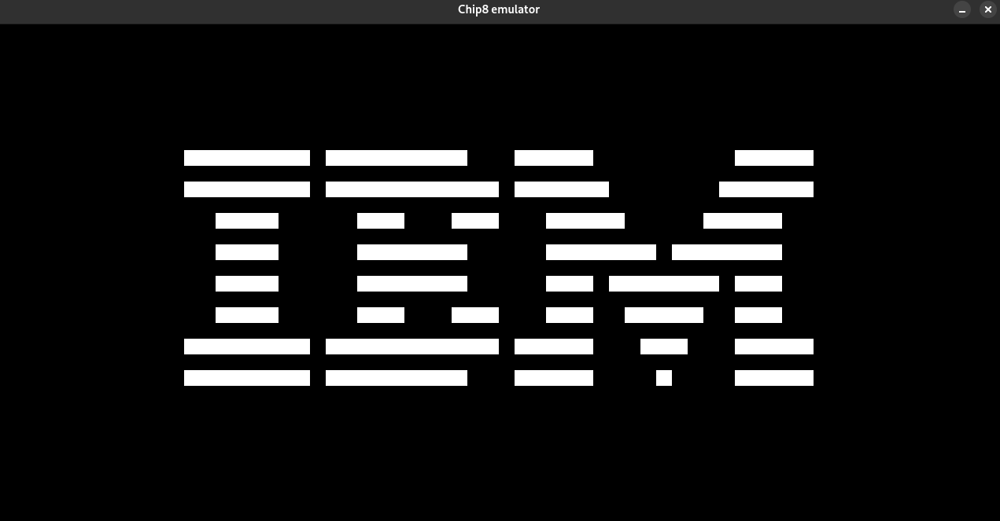

# chip8-emulator
chip8 emulator in C from Tobias V. Langhoff guide


## Build
```
mkdir -p build
make
```

## run
```
./build/main -f <fname>
```

- `-f` Path to the CHIP-8 instructions

## Clean
```
make clean
```

## Notes
`8XY6` and `8XYE` instructions behave differently depending on the processor.
On the COSMAC_VIP, they will put the value of VY into VX before shifting.
However, on other processor starting from CHIP-48 and SUPER-CHIP, these instructions simply shifted VX and ignored VY completely.

To behave like the COSMAC_VIP, you can set `SHIFT_INSTRUCTION_COSMAC_VIP` to `true` in `headers/chip8.h`. Otherwise, set it to `false`.

## Example
Here is an example displaying the IBM logo :

```
./build/main -f tests/ibm_logo.ch8
```

